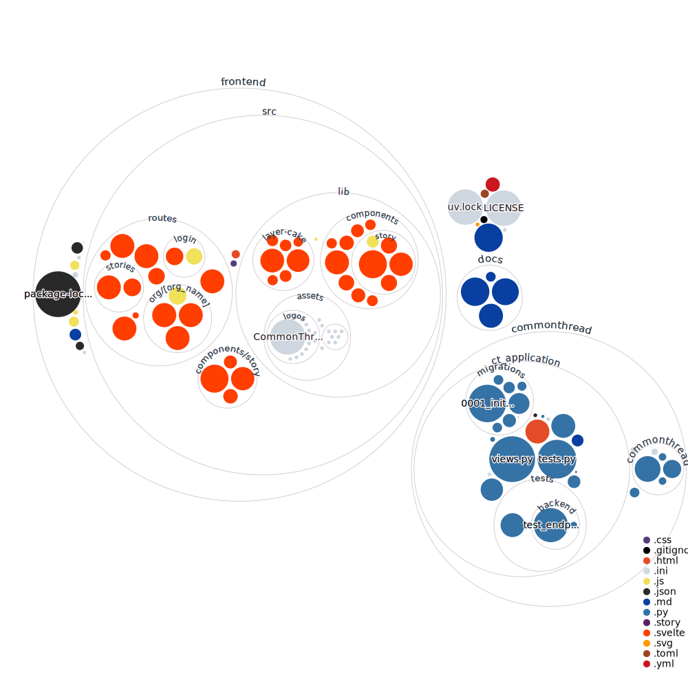

 

# 🧵CommonThread🧵

CommonThread is an open-source collaborative tool that enables users to turn stories into insights. Community-based organizations, journalists, researchers, and community members alike can use the tool to efficiently gather stories, aggregate them, and understand common threads to draw insights for action.

## Set Up :hammer:

To set up a local development environment, follow these steps:

1. **Install UV**: If you haven't already, install UV
2. **Sync the Environment**: After installing UV, you need to sync the environment. This will set up the necessary configurations and dependencies for your project. Run the following command:
```bash
uv sync
```

## Project Structure :card_index_dividers:
- backend/
    - app/
        - auth/
        - public/
        - org/
        - preprocessor/
        - ml/
        - db/
    - tests/
    - run/
- frontend/
    - public/
    - org/
    - shared/
    - assets/



## Issue Tracker :mag:
Check our [issue tracker](https://github.com/orgs/uchicago-capp-30320/projects/10/views/1).
